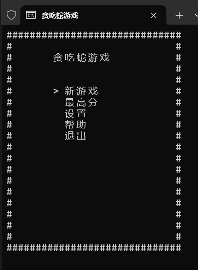
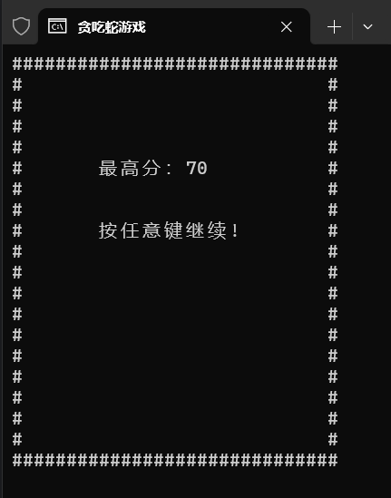
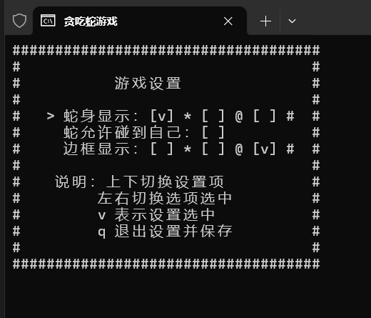
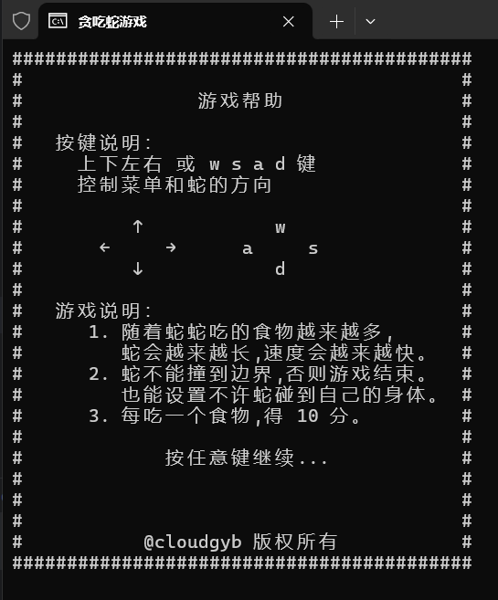

# 贪吃蛇

## 环境说明

目前仅支持 windows 环境

## 操作说明

菜单和蛇上下左右分别使用↑ ↓ ← → 或 w s a d 键 

```
                  ↑
   ↑              w
←     →       ← a   d →
   ↓              s
                  ↓  
```

## 游戏说明

- 随着蛇蛇吃的食物越来越多，蛇身会越来越长，速度也会原来越快。
- 蛇不能撞到边界，否则游戏结束。
- 每吃一个食物，得 10 分。

## 游戏截图

- 菜单



- 正常运行


- Game Over


- 最高分



- 设置



- 帮助


