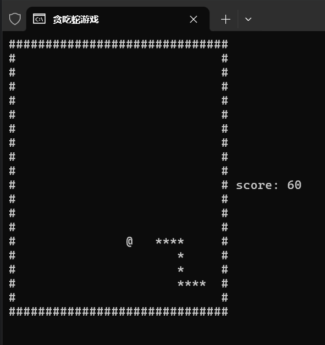
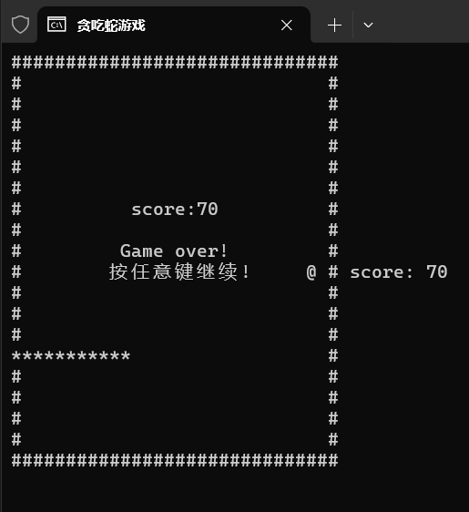

# 贪吃蛇

## 环境说明

目前仅支持 windows 环境

## 操作说明

上下左右分别使用 w s a d 键，q 退出游戏

```
    ↑
    w
← a   d →
    s
    ↓  
```

## 游戏说明

- 随着蛇蛇吃的食物越来越多，蛇身会越来越长，速度也会原来越快。
- 蛇不能撞到边界，否则游戏结束。
- 每吃一个食物，得 10 分。

## 游戏截图

- 正常运行



- Game Over


